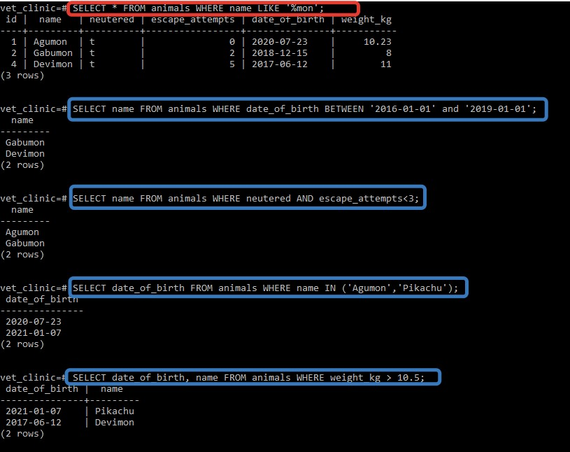
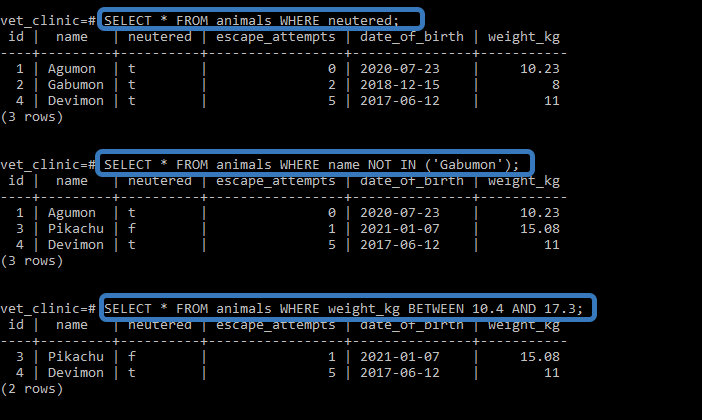

# Vet Clinic
> In this project we will use a relational database to create the data structure for a vet clinic. 
## Getting Started

This repository includes files with plain SQL that can be used to recreate a database:

- Use [schema.sql](./schema.sql) to create all tables.
- Use [data.sql](./data.sql) to populate tables with sample data.
- Check [queries.sql](./queries.sql) for examples of queries that can be run on a newly created database. 

## Authors

👤 **Melashu Amare**

- GitHub: [@githubhandle](https://github.com/melashu)
- Twitter: [@twitterhandle](https://twitter.com/meshu102)
- LinkedIn: [LinkedIn](https://www.linkedin.com/in/melashu-amare/)

## 🤝 Contributing

Contributions, issues, and feature requests are welcome!

Feel free to check the [issues page](../../issues/).

## Show your support

Give a ⭐️ if you like this project!

## Screenshot 

## Acknowledgments

- Hat tip to anyone whose code was used
- Inspiration
- etc

## 📝 License

This project is [MIT](./LICENSE) licensed.
